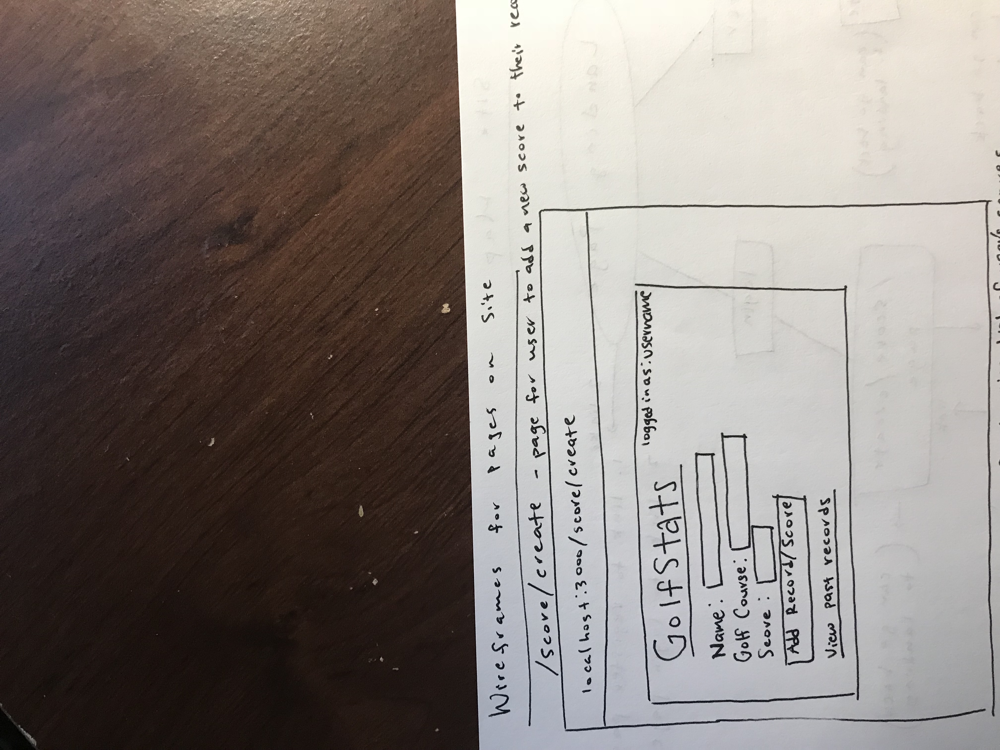
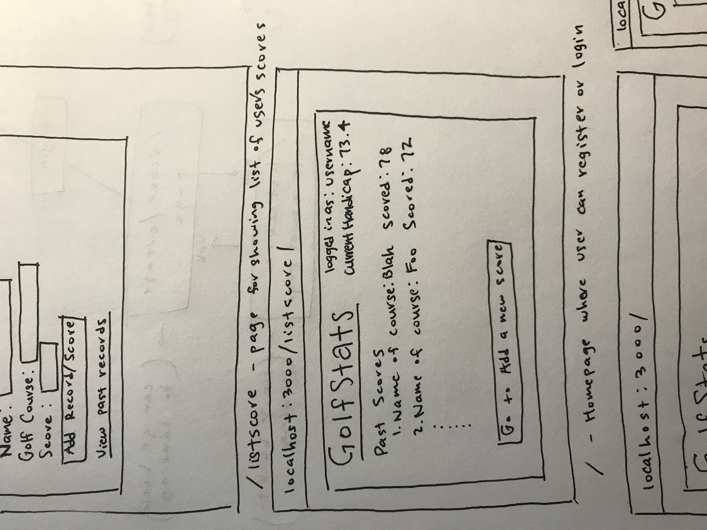
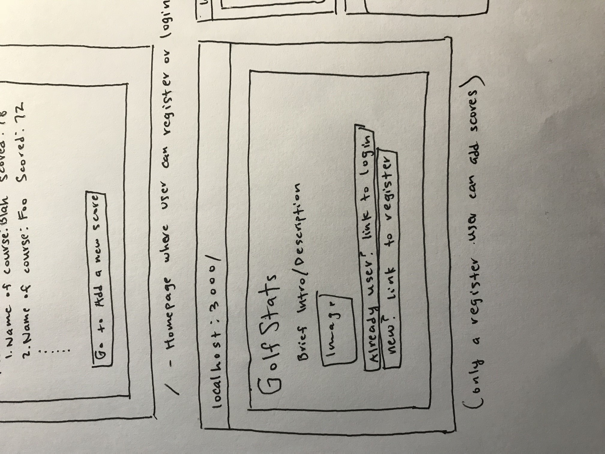
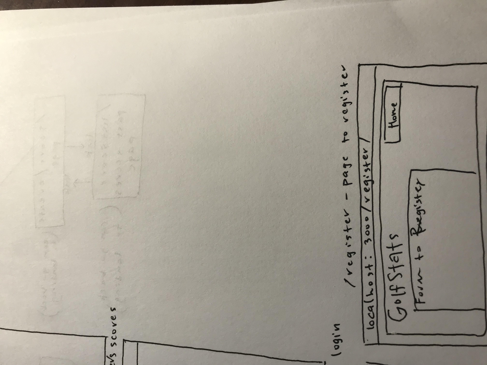
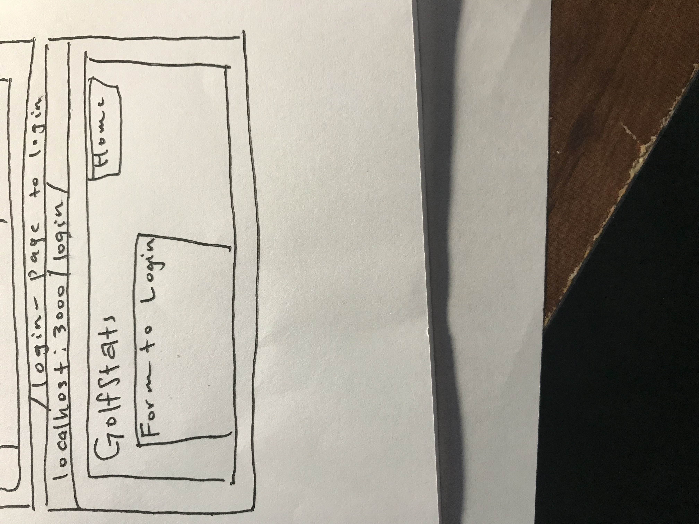
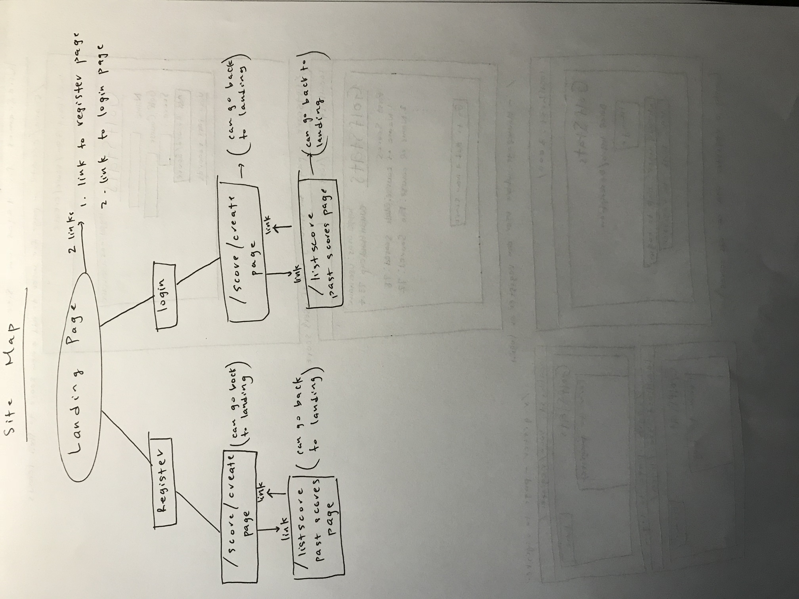

# GolfStats

## Overview

Sometimes it's difficult for golfers to keep track of their handicap/average and they don't know exactly
what their skill level is. Sooo...that's where GolfStats comes in!

## Data Model

The application will store Users, Scores, and Average/Handicap

* users can have multiple scores (via references)
* each each will have a single update avg/handicap based on their single list of multiple scores

An Example User:

```javascript
{
  username: "paulpark",
  hash: // a password hash,
  scores: // list of scores for this user
  average: // user's handicap
}
```

## [Link to Commented First Draft Schema](db.js)

## Wireframes

/score/create - page for user to add a new score to their current record



/listscore - page for showing list of user's scores



/ - landing page where user can choose to register or login



/register - page to register



/login - page to log in



## Site map



## User Stories or Use Cases

1. as non-registered user, I can register a new account with the site
2. as a user, I can log in to the site
3. as a user, I can add scores to my profile/record of current scores
4. as a user, I can view all my past records/scores in relation to the different courses I played on
5. as a user, I can edit or delete the information that is already stored in my records page with provided
   edit and delete buttons which will then be updated on the database (maybe)

## Research Topics
* (5 points) Integrate user authentication
    * I'm going to be using passport for user authentication
* (4 points) Perform client side form validation using a JavaScript library
* (2 points) Maybe going to integrate a CSS framework throughout my site
    * Planning to use Bootstrap but can change

11 points total out of 8 required points


## [Link to Initial Main Project File](app.js)

## Annotations / References Used

1. [passport.js authentication docs](http://passportjs.org/docs)
2. [Twitter Bootstrap docs](http://getbootstrap.com/2.3.2/)
